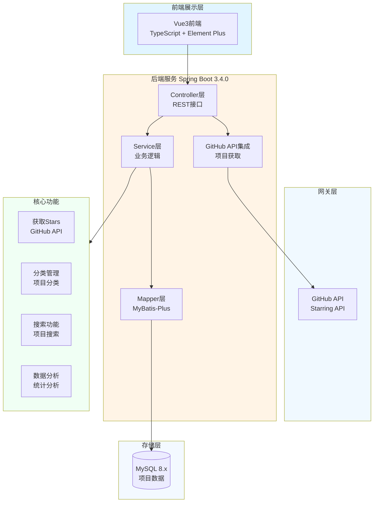

# JOSP-restoreGithubStars - GitHub Stars 管理系统


> 整理和管理 GitHub Stars 项目的后台系统

## 📖 项目简介

JOSP-restoreGithubStars 是一个用于整理和管理 GitHub Stars 项目的后台系统。通过 GitHub API 获取用户的 Star 项目列表,并提供分类、搜索、分析等功能,帮助用户更好地管理和发现优质开源项目。

**前端项目**: [JOSP-restoreGithubStarsVue3](../JOSP-restoreGithubStarsVue3)

## 🏗️ 系统架构



## 🛠️ 技术栈

| 技术 | 版本 | 说明 |
|------|------|------|
| **Spring Boot** | 3.4.0 | 核心框架 |
| **Java** | 17 | 开发语言 |
| **MyBatis-Plus** | 3.5.7 | ORM框架 |
| **Spring Data JPA** | - | JPA支持 |
| **MySQL** | 8.x | 数据库 |
| **PageHelper** | 6.1.0 | 分页插件 |
| **Knife4j** | 4.5.0 | API文档 |
| **Hutool** | 5.8.26 | 工具库 |
| **Vue** | 3 | 前端框架 |
| **TypeScript** | - | 类型支持 |
| **Element Plus** | - | UI组件库 |

## 📦 核心依赖

### Web层
- `spring-boot-starter-web` - Web开发
- `spring-boot-starter-webflux` - 响应式Web

### 数据层
- `mybatis-plus-spring-boot3-starter` - MyBatis增强
- `spring-boot-starter-data-jpa` - JPA支持
- `pagehelper` - 分页插件
- `mysql-connector-java` - MySQL驱动

### 工具层
- `lombok` - 简化代码
- `hutool-all` - 工具集
- `jackson-databind` - JSON处理

### 文档层
- `knife4j-openapi3-jakarta-spring-boot-starter` - API文档

## 🚀 快速开始

### 环境要求
- JDK 17+
- Maven 3.6+
- MySQL 8.0+
- Node.js 18+ (前端项目)

### 安装步骤

1. **克隆项目**
```bash
git clone https://github.com/your-username/JOSP-restoreGithubStars.git
cd JOSP-restoreGithubStars
```

2. **创建数据库**
```sql
CREATE DATABASE github_stars;
USE github_stars;
-- 执行项目中的demo.sql脚本
SOURCE db/demo.sql;
```

3. **配置GitHub Token**
```yaml
# application.yml
github:
  api:
    token: your_github_token  # GitHub Personal Access Token
    base-url: https://api.github.com
```

4. **配置数据库**
```yaml
# application.yml
spring:
  datasource:
    url: jdbc:mysql://localhost:3306/github_stars
    username: root
    password: your_password
```

5. **运行项目**
```bash
mvn clean install
mvn spring-boot:run
```

6. **访问服务**
- 后端地址: http://localhost:8081
- API文档: http://localhost:8081/doc.html

## 📁 项目结构

```
JOSP-restoreGithubStars/
├── src/main/java/
│   └── wo1261931780/
│       ├── controller/          # 控制器层
│       │   ├── GitHubController.java     # GitHub API接口
│       │   ├── StarController.java       # Stars管理接口
│       │   └── CategoryController.java   # 分类管理接口
│       ├── service/             # 业务逻辑层
│       │   ├── GitHubService.java        # GitHub服务
│       │   ├── StarService.java          # Stars服务
│       │   └── impl/
│       ├── mapper/              # 数据访问层
│       ├── entity/              # 实体类
│       │   ├── GitHubStar.java           # Star项目实体
│       │   └── Category.java             # 分类实体
│       ├── config/              # 配置类
│       │   ├── GitHubConfig.java         # GitHub配置
│       │   └── SwaggerConfig.java        # API文档配置
│       └── utils/               # 工具类
├── src/main/resources/
│   ├── application.yml          # 配置文件
│   └── db/
│       └── demo.sql             # 数据库脚本
└── pom.xml
```

## 🔌 核心功能

### 1. 获取GitHub Stars
```java
@Service
public class GitHubService {
    @Value("${github.api.token}")
    private String githubToken;
    
    public List<GitHubStar> fetchStars(String username) {
        String url = "https://api.github.com/users/" + username + "/starred";
        HttpHeaders headers = new HttpHeaders();
        headers.set("Authorization", "token " + githubToken);
        
        ResponseEntity<GitHubStar[]> response = restTemplate.exchange(
            url, HttpMethod.GET, new HttpEntity<>(headers), 
            GitHubStar[].class
        );
        
        return Arrays.asList(response.getBody());
    }
}
```

### 2. 项目分类管理
```java
@Service
public class CategoryService {
    public void categorize(Long starId, Long categoryId) {
        // 项目分类
        GitHubStar star = starMapper.selectById(starId);
        star.setCategoryId(categoryId);
        starMapper.updateById(star);
    }
    
    public List<GitHubStar> getByCategory(Long categoryId) {
        // 根据分类查询项目
        return starMapper.selectByCategoryId(categoryId);
    }
}
```

### 3. 搜索功能
```java
@GetMapping("/search")
public Result<List<GitHubStar>> search(
    @RequestParam(required = false) String keyword,
    @RequestParam(required = false) String language,
    @RequestParam(required = false) Long categoryId
) {
    LambdaQueryWrapper<GitHubStar> wrapper = new LambdaQueryWrapper<>();
    
    if (StringUtils.isNotBlank(keyword)) {
        wrapper.like(GitHubStar::getName, keyword)
               .or()
               .like(GitHubStar::getDescription, keyword);
    }
    
    if (StringUtils.isNotBlank(language)) {
        wrapper.eq(GitHubStar::getLanguage, language);
    }
    
    if (categoryId != null) {
        wrapper.eq(GitHubStar::getCategoryId, categoryId);
    }
    
    return Result.success(starMapper.selectList(wrapper));
}
```

### 4. 统计分析
```java
@GetMapping("/analysis")
public Result<Map<String, Object>> analysis() {
    Map<String, Object> result = new HashMap<>();
    
    // 按语言统计
    Map<String, Long> languageStats = starMapper.selectList(null)
        .stream()
        .collect(Collectors.groupingBy(
            GitHubStar::getLanguage, 
            Collectors.counting()
        ));
    
    // 按分类统计
    Map<Long, Long> categoryStats = starMapper.selectList(null)
        .stream()
        .collect(Collectors.groupingBy(
            GitHubStar::getCategoryId, 
            Collectors.counting()
        ));
    
    result.put("languageStats", languageStats);
    result.put("categoryStats", categoryStats);
    result.put("totalStars", starMapper.selectCount(null));
    
    return Result.success(result);
}
```

## 📊 数据库设计

### Star项目表(github_star)
```sql
CREATE TABLE `github_star` (
  `id` bigint NOT NULL AUTO_INCREMENT,
  `repo_id` bigint COMMENT 'GitHub仓库ID',
  `name` varchar(255) COMMENT '仓库名称',
  `full_name` varchar(255) COMMENT '完整名称',
  `description` text COMMENT '描述',
  `html_url` varchar(500) COMMENT 'GitHub地址',
  `language` varchar(50) COMMENT '编程语言',
  `stargazers_count` int COMMENT 'Star数量',
  `forks_count` int COMMENT 'Fork数量',
  `category_id` bigint COMMENT '分类ID',
  `starred_at` datetime COMMENT 'Star时间',
  PRIMARY KEY (`id`),
  KEY `idx_language` (`language`),
  KEY `idx_category` (`category_id`)
);
```

### 分类表(category)
```sql
CREATE TABLE `category` (
  `id` bigint NOT NULL AUTO_INCREMENT,
  `name` varchar(100) COMMENT '分类名称',
  `description` varchar(500) COMMENT '分类描述',
  `parent_id` bigint COMMENT '父分类ID',
  PRIMARY KEY (`id`)
);
```

## 🔧 GitHub API集成

### 参考文档
- [GitHub API - Starring](https://docs.github.com/zh/rest/activity/starring?apiVersion=2022-11-28)

### API端点
```java
// 获取用户的Star列表
GET https://api.github.com/users/{username}/starred

// 获取当前用户的Star列表
GET https://api.github.com/user/starred

// 检查是否Star了某仓库
GET https://api.github.com/user/starred/{owner}/{repo}

// Star仓库
PUT https://api.github.com/user/starred/{owner}/{repo}

// 取消Star
DELETE https://api.github.com/user/starred/{owner}/{repo}
```

## 🔍 使用示例

### 1. 同步Stars
```bash
curl -X POST http://localhost:8081/api/github/sync \
  -H "Content-Type: application/json" \
  -d '{"username": "your-username"}'
```

### 2. 搜索项目
```bash
curl "http://localhost:8081/api/stars/search?keyword=spring&language=java"
```

### 3. 分类管理
```bash
curl -X POST http://localhost:8081/api/categories \
  -H "Content-Type: application/json" \
  -d '{"name": "Spring Boot", "description": "Spring Boot相关项目"}'
```

## 📝 开发指南

### GitHub Token配置
1. 访问 GitHub Settings > Developer settings > Personal access tokens
2. 生成新的 Token
3. 选择必要的权限(至少需要 `repo` 或 `public_repo`)
4. 将 Token 配置到 `application.yml`

### 分页查询
```java
@GetMapping("/page")
public Result<PageResult<GitHubStar>> page(
    @RequestParam(defaultValue = "1") Integer pageNum,
    @RequestParam(defaultValue = "10") Integer pageSize
) {
    PageHelper.startPage(pageNum, pageSize);
    List<GitHubStar> list = starMapper.selectAll();
    return Result.success(PageResult.of(list));
}
```

## 📈 性能优化

### 1. 缓存优化
```java
@Cacheable(value = "stars", key = "#username")
public List<GitHubStar> fetchStars(String username) {
    // GitHub API调用
}
```

### 2. 异步同步
```java
@Async
public CompletableFuture<Void> syncStarsAsync(String username) {
    List<GitHubStar> stars = fetchStars(username);
    batchInsert(stars);
    return CompletableFuture.completedFuture(null);
}
```

## 📝 更新日志

### v0.0.1-SNAPSHOT
- 初始化项目结构
- 集成GitHub API
- 实现Stars获取和存储
- 实现分类管理
- 实现搜索功能
- 添加统计分析功能

## 🤝 贡献指南

欢迎提交 Issue 和 Pull Request!

## 📄 许可证

本项目采用 MIT 许可证 - 查看 [LICENSE](LICENSE) 文件了解详情

## 📮 联系方式

- 作者: junw
- Email: wo1261931780@gmail.com
- GitHub: [@wo1261931780](https://github.com/wo1261931780)

## 🙏 致谢

感谢 GitHub API 提供的支持!

---

**说明**: 本项目主要用于管理和整理 GitHub Stars 项目,帮助用户更好地发现和分类优质开源项目。
